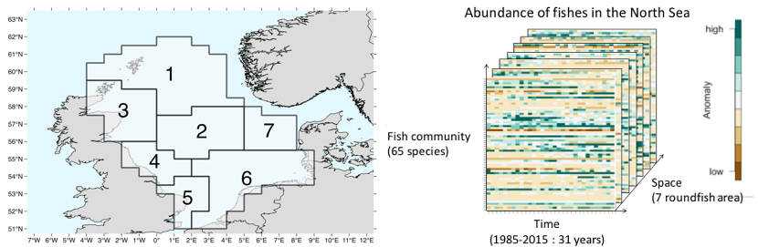
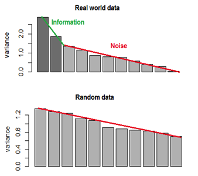

## Objectives :
At the end of this workshop, you should be able to :

*	Run a Principal component analysis (PCA) on a matrix (2D)
* Interpret main Principal Components (PC)
* Run a Principal tensor analysis (PTA) on a array (3D)
* Interpret main Principal Tensor (PT)
*	Run a clustering analysis with Hierarchical Clustering 
* Get an understanding of what is a multivariate analysis, and when it can be usefull

##A. Getting ready :

####Get ready :

1. Start RStudio (double click on the icon)  
2. Create a new script (Ctrl+Shift+N)  
3. Get the data file (*IBTS_Tensor.Rdata*), and the two R-scripts   
4. Set the working directory (Session > Set Working Directory) to the directory where the the data and the script are.

####Load the package and needed functions
For this work, we will need to use three package [ade4], [PTAk] and [RColorBrewer].
```{r, message=FALSE}
library(ade4)
library(PTAk)
library(RColorBrewer)
source("Myheatmap.R") #load a home made function to plot a heatmap
```

If you have an error message, please be sure the packages are installed. If not, use the  function `install.packages(c("ade4", "PTAk", "RColorBrewer"))`.


### Load the dataset
```{r, comment =""}
load("IBTS_Tensor.Rdata")
dim(IBTS_tensor)
```
You loaded a variable called `IBTS_tensor` which is an array with three dimension : 65 fish species in the first dimension, 31 years in the second dimension, and 7 roundfish areas (RA) in the third dimension.
To see the names of the dimension, you can type :
```{r, results='hide'}
dimnames(IBTS_tensor)
```

***




Abundance data comes from the ICES DAtabase for TRAwl Surveys (DATRAS; http://datras.ices.dk/ Home/Default.aspx). The North Sea International Bottom Trawl Survey (NS-IBTS) is an international effort to sampled the demersal fish communities in the North Sea annually and consistently with a standard otter trawl net (*chalut Grande Ouverture Verticale*, GOV) hauled over the seabed for 30 min. The data is openly available online and the Catch per Unit Effort (CPUE) per length class and per area was downloaded for the first quarter of the period 1985 to 2015 for the roundfish area (RA) 1 to 7. Pre-processing was performed to clean the data, remove the pelagic and the rare species and to transform the CPUE in a three dimensional array, per species, year and roundfish areas (RA). 

***

### Understanding the variables
While loading the data, we saw two different type of variables, quite unusual in R : array and lists.

####List
List can contain all kind of elements, not all of the same lenght, or of the same type (could be characters or numbers). The number of elements is given by function is `length()`, and the different elements are accessed by `[[ ]]`. The names of the dimensions of the variable `IBTS_tensor` is a list. 
```{r, comment =""}
length(dimnames(IBTS_tensor))
dimnames(IBTS_tensor)[[2]] #show the second element of the list
```

####Array
Array is a generalization of matrices, in higher number of dimension. It can only contain numbers. The dimmension of the array is given by the function is `dim()`, and the different elements are accessed with `[ ]`, similar to a matrix or a data.frame : 
```{r, comment =""}
dim(IBTS_tensor)
IBTS_tensor[18,14,6]#Select one element, e.g. Abundance of Cod, in 1998, in RA6
IBTS_tensor[18,,6]#Select one vector, e.g. abundance of Cod in 1998
```
```{r, comment ="", eval=FALSE}
IBTS_tensor[18,,]#Select one matrix, e.g. abundance of Cod
```
```{r, comment ="", echo=FALSE}
head(IBTS_tensor[18,,])
```

### Your turn : 
1. What is the index of Hake (Merluccius merluccius) in the dataset ?
2. What is the abondance of Hake (Merluccius merluccius) in 1988 in RA 1 ?
3. What is the abondance of Hake between 2010 and 2015 in RA 1?
4. Can you show the evolution of Hake abondance between 1985 and 2015 in RA 1?

```{r, echo = FALSE, collapse=TRUE, comment =""}
which(dimnames(IBTS_tensor)[[1]]=="Merluccius merluccius")
IBTS_tensor[33,4,1]
IBTS_tensor[33,26:31,1]
plot(dimnames(IBTS_tensor)[[2]], IBTS_tensor[33,,1], type="l", 
     xlab="Time", ylab="CPUE (n/h)", main="Abundance of Hake in RA1")
```

#### Solution
```{r, eval = FALSE, collapse=TRUE, comment =""}
#1
which(dimnames(IBTS_tensor)[[1]]=="Merluccius merluccius")
#2
IBTS_tensor[33,4,1]
#3
IBTS_tensor[33,26:31,1]
#4
plot(dimnames(IBTS_tensor)[[2]], IBTS_tensor[33,,1], type="l", 
     xlab="Time", ylab="CPUE (n/h)", main="Abundance of Hake in RA1")
```

***

##B. Two dimensions : Principal Component Analysis

### Preparing the dataset

#### From 3D to 2D
The abondance of fishes will be average over the period 1985-2015. We will loose the temporal information, and only look at the spatial differences between the species.
We create a new matrix `IBTS_space` which contain the average abondance for the 7 RA (in rows) and 65 species (in columns).
```{r, collapse=TRUE, comment =""}
IBTS_space <- apply(IBTS_tensor,c(3,1),mean)
dim(IBTS_space)
```

#### Checking the distribution of the data
Principal Component Analysis, and other multivariate analysis in general, are sensible to outliers. So beforehand, one has to be check if the data is not too skewed. If it is the case, it is recommended to log (or square root) transform the data.

```{r, collapse=TRUE, fig.show='hide', comment =""}
#boxplot() is used to look at the distribution
boxplot(as.vector(IBTS_space), main="raw CPUE")
#The CPUE is very skewed, one can not see the difference between the 1st quarter, the median and the 3rd quarter
#So data should be log transformed
IBTS_logspace <- log(IBTS_space+1)
#The new distribution of the log tranformed CPUE
boxplot(as.vector(IBTS_logspace), main="log CPUE")
```

```{r, echo=FALSE}
par(mfrow=c(1,2), mar=c(3,3,3,1))
boxplot(as.vector(IBTS_space), main="raw CPUE")
boxplot(as.vector(IBTS_logspace), main="log CPUE")
```

#### Scaling the data
A Principal Components Analysis normalize (i.e. center and scale) the variables. It is important to keep that step in mind. An illustration of the normalisation is given in the figures below. 
```{r, collapse=TRUE, echo=FALSE, comment =""}
par(mfrow=c(2,1), mar=c(2,4,3,1))
boxplot(IBTS_logspace, main="Abundance", ylab="CPUE in log", 
        xaxt="n")
mtext("Species", side = 1, line = 0)
boxplot(scale(IBTS_logspace), main="Anomaly (= abundance normalized per species)", 
        ylab="Anomaly", xaxt="n")
mtext("Species", side = 1, line = 0)
```

### Run a PCA

#### Run the PCA and choosing the number of PC.
The PCA is run with the function `dudi.pca`. The data is normalized so the options `scale` and `center` are set to `TRUE`. The function is interactive, showing you the plot of the variance explained by the successive Principal Components (PC)

***

To choose the right number of PC to be kept, there are many conflicting methods. The one I recommend is the scree test (Cattell, 1966): detect graphically a bend in the distribution of the successive variance explained. As a comparison, a PCA run on random data will not find *strong* PC, i.e. PC can not reduce dimensionality of the data. On the contrary, in real world data, usually we have a bend between successive variance explained by PC. Before the bend, the PCs reduce well the dimensionality of the data (i.e. there is a pattern); after the bend, it is only noise. 



***

```{r, eval=FALSE}
pca_space=dudi.pca(IBTS_logspace, scale = TRUE, center = TRUE)
```
**Select the number of axes: **

```{r, echo=FALSE, comment ="", fig.height=4, fig.width=6}
pca_space=dudi.pca(IBTS_logspace, scannf = FALSE, nf=2)
barplot(inertia.dudi(pca_space)$TOT$inertia, ylab="Percentage of variance", xlab="PC")
```

In our case, we see a bend in the scree plot after the second PC. So, **please type 2 and press Enter**.

The function `inertia.dudi` show how much variance is explained by the successive PC.
```{r, comment =""}
#To see how much variance the axes explain :
inertia.dudi(pca_space)$TOT
```
In our case, the first PC explains 41% of the variance, the two first PC together explain 62% of the variance.

#### Interpretation of the PC.
The variable `pca_space`, result of the `dudi.pca`, contains two important matrices : `co`with the projetion of columns in the two PC; and `li` with the projection of the raws in the two PCs. We can see the projection in a table directly by typing the name of these object, or by using graphical functions.
```{r, comment ="", fig.height=3.5}
pca_space$li # or pca_space$co
par(mfrow=c(1,2), mar=c(0,0,0,0))
#Show the weight of the variables :
s.label(pca_space$li, xax=1, yax=2) #on PC 1 and 2
s.label(pca_space$co, clabel = 0.4) #on PC 1 and 2
```

The first PC (x-axis) make the difference between the northern NS (RA 1, 2 and 3 have negative weights, projected on the left side) and the southern NS (RA 5 and 6 have positive weights, projected on the right side).  
The second PC (y-axis) make the difference between the South-Eastern NS (RA 7 have negative weight, projected on the lower side) and the rest of northern or western NS (RA 1 and 5 have positive weights, projected on the upper side).  
The species projection (right side) allow us to see differences between species, but the high number of species makes it difficult to see the individual differences. One solution is to group these species,  simplify the number of species into smaller number of groups.

### Clustering the species
Clustering is a subject by itself, here we will only see one of its method : Hierarchical clustering.
It works in 4 steps : 

1. Compute the distances between each objects. 
2. Build a tree according to a given joining criteria
3. Choose the number of cluster depending on the topology of the dendogram,
4. Create the clusters and interpret them

```{r, comment =""}
#1. Compute the distance between species
dist_species=dist(pca_space$co, method = "euclidean")

#2. Build a tree with Ward method
den=hclust(dist_species,method = "ward.D2")

#3. Plot the dendogram
par(mfrow=c(1,1))
plot(den, hang=-1, ax = T, ann=T, xlab="", sub="", cex=0.6)

#Choosing the number of cluster
nclust<-5

#Visualize the cutting
rect.hclust(den, k=nclust, border="dimgrey")

#Create the clusters
clust_space <- as.factor(cutree(den, k=nclust))

#Visaualize the cluster in the PC axis
s.class(pca_space$co,fac=clust_space, col=rainbow(nclust),xax=1,yax=2)
table(clust_space)
```

***

## C. Three dimension : Tensor Decomposition

### Preparing the dataset

#### Checking the distribution of the data
Like with PCA, we have to check the skewness of the data and log transform it if it is higly skewed.

```{r, collapse=TRUE, fig.show='hide', comment =""}
#boxplot() is used to look at the distribution
boxplot(IBTS_tensor, main="raw CPUE")
#Data should be log transformed
IBTS_logtensor <- log(IBTS_tensor+1)
#The new distribution of the log tranformed CPUE
boxplot(IBTS_logtensor, main="log CPUE")
```

```{r, echo=FALSE}
par(mfrow=c(1,2), mar=c(3,3,3,1))
boxplot(as.vector(IBTS_tensor), main="raw CPUE")
boxplot(as.vector(IBTS_logtensor), main="log CPUE")
```

#### Scaling the data
Contrary to PCA, the normalization of a tensor is not straightforward, and have to be done manually before running a PTA. Here, we decided to narmalized the values per species.

```{r, collapse=TRUE, comment =""}
#Scaling per species
#Create a new empty array
IBTS_logscale<-array(0,dim=dim(IBTS_tensor))
#Loop scanning each species
for (i in 1:dim(IBTS_tensor)[1]){
  #Calculating the mean and sd of the log CPUE for species i
  ma<-mean(IBTS_logtensor[i,,])
  sa<-sd(IBTS_logtensor[i,,])
  #Saving the anomaly in the array
  IBTS_logscale[i,,]<-(IBTS_logtensor[i,,]-ma)/sa
}
#Copy the labels to the new array
dimnames(IBTS_logscale)<-dimnames(IBTS_tensor)
```

### Run a PTA
#### Run the PTA and choosing the number of PT.
The PTA is run with the function `PTA`. The number of principal tensor is indicated by `nbPT` and `nbPT2`
The Principal Tensor Analysis computed three main principal tensor and their two mode associated principal tensors.
```{r, comment =""}
PTA<-PTA3(IBTS_logscale, nbPT = 3, nbPT2 = 3, minpct = 0.1)
summary.PTAk(PTA,testvar = 0)
```

#### Choosing the number of PT.

To select the significant PT, we build the scree plot from the global variance explained.
```{r, comment =""}
#Create the scree plot
out <- !substr(PTA[[3]]$vsnam, 1, 1) == "*"
gct<-(PTA[[3]]$pct*PTA[[3]]$ssX/PTA[[3]]$ssX[1])[out]
barplot(sort(gct, decreasing = TRUE), xlab="PT",
        ylab="Percentage of variance")
```

####Interpretation of PT.
The ploting function per default allow to use the argument `mod` to select which dimension to plot, `nb1` and `nb2` to select which PT will be shown on x-axis and y-axis.
For example, to see the time and space components projected on vs111 and vs222 :
```{r, comment ="", fig.width=8}
par(mfrow=c(1,2))
plot(PTA, mod=c(2,3), nb1 = 1, nb2 = 11, xpd=NA)
plot(PTA, mod=1, nb1 = 1, nb2 = 11)
```

You can explore further what are the main characteristics of the PT, which are number 1, 6, 7 and 11. Another way is to use a 2D representation of the projection

```{r, comment =""}
#Define which PT have been selected
keep <- c(1, 6, 7, 11)

#Create the name of each PT
labkeep <- paste0(paste0("PT", 1:4), " - ", 
                  round((100 * (PTA[[3]]$d[keep])^2)/PTA[[3]]$ssX[1],1), "%")

#Make the plot
par(mfrow=c(2,2), mar = c(3,3,3,1))
for (i in seq_along(keep)){
  lab <- labkeep[i]
  temp <- PTA[[3]]$v[keep[i],] %o% PTA[[2]]$v[keep[i],]
  dimnames(temp) <- list(dimnames(IBTS_tensor)[[3]], dimnames(IBTS_tensor)[[2]])
  myHeatmap(temp, pal="BrBG", title=lab, colscale = FALSE, mary = -3)
}
```

###Clustering
We use the same approach as before, but with the species projected on the 4 PT.
```{r, comment =""}
#Create a variable with the projection of species on the 4 PT
coo<-t(PTA[[1]]$v[c(keep),])

#1. Compute the distance between species
dist1=dist(coo, method = "euclidean")

#2. Build a tree with Ward linkage
den=hclust(dist1,method = "ward.D2")

#3. Plot the dendogram
par(mar=c(1,3,1,1))
plot(den, hang=-1, ax = T, ann=F, xlab="", sub="",labels = FALSE)

#Choose the number of clusters
nclust<-6

#Visualize the cutting
rect.hclust(den, k=nclust, border=rainbow(nclust)[c(6,5,2,4,3,1)])
```

```{r, comment ="", fig.width=9, fig.height=4}
#4. Create the clusters
clust_3D <- as.factor(cutree(den, k=nclust))

#Visualize them 
par(mfrow=c(1,3))
s.class(coo, fac = clust_3D, xax=1, yax=2, col=rainbow(nclust), clabel = 2)
text(min(coo[,1])-0.03,0, labkeep[2], srt=90, xpd=NA, cex=1.5)
text(0,max(coo[,2])+0.02, labkeep[1], xpd=NA, cex=1.5)
s.class(coo, fac = clust_3D, xax=1, yax=3, col=rainbow(nclust), clabel = 2)
text(min(coo[,1])-0.03,0, labkeep[3], srt=90, xpd=NA, cex=1.5)
text(0,max(coo[,3])+0.02, labkeep[1], xpd=NA, cex=1.5)
s.class(coo, fac = clust_3D, xax=1, yax=4, col=rainbow(nclust), clabel = 2)
text(min(coo[,1])-0.03,0, labkeep[4], srt=90, xpd=NA, cex=1.5)
text(0,max(coo[,4])+0.02, labkeep[1], xpd=NA, cex=1.5)
```


##Summary

