# Multivariate analysis: from 2D PCA to 3D PTA
Romain Frelat  
20 october 2016  

## Objectives:
At the end of this workshop, you should be able to:

*	Run a Principal component analysis (PCA) on a matrix (2D)
* Interpret the Principal Components (PC)
* Run a Principal tensor analysis (PTA) on a array (3D)
* Interpret the Principal Tensor (PT)
*	Run a clustering analysis with Hierarchical Clustering 

* **Understand what is a multivariate analysis, and when it can be useful**

##A. Getting ready:

###Get ready:

1. Get the zip file *Multivariate2D3D.zip* (can be downloaded: https://github.com/rfrelat/Multivariate2D3D/)
2. Unzip the archive in a new folder. The zip file contain the data (*IBTS_Tensor.Rdata*), the R-script (*script_Multivariate2D3D.R*) and the present document as a pdf
3. Open the R script *script_Multivariate2D3D.R* with your favourite R editor (RStudio is recommended)
4. Be sure to set the working directory (Session > Set Working Directory) to the directory where the script and the data are.

###Load the package and needed functions
For this work, we will need to use two package *ade4* and *PTAk*.

```r
library(ade4)
library(PTAk)
```

If you have an error message, check if the packages are installed. If not, use the function `install.packages(c("ade4", "PTAk")`.


### Load the dataset
The data is a *Rdata* file, that can be loaded with the function `load()`.

```r
load("IBTS_Tensor.Rdata")
dim(IBTS_tensor)
```

```
[1] 65 31  7
```
You loaded a variable called `IBTS_tensor` which is an array with three dimension: 65 fish species in the first dimension, 31 years in the second dimension, and 7 roundfish areas (RA) in the third dimension.
To see the names of the dimension, you can type:

```r
dimnames(IBTS_tensor)
```

***


Abundance data comes from the ICES DAtabase for TRAwl Surveys (DATRAS; http://datras.ices.dk/ Home/Default.aspx). The North Sea International Bottom Trawl Survey (NS-IBTS) is an international effort to sampled the demersal fish communities in the North Sea annually and consistently with a standard otter trawl net (*chalut Grande Ouverture Verticale*, GOV) hauled over the seabed for 30 min. The data is openly available online and the Catch per Unit Effort (CPUE) per length class and per area was downloaded for the first quarter of the period 1985 to 2015 for the roundfish area (RA) 1 to 7. Pre-processing was performed to clean the data, remove the pelagic and the rare species and to transform the CPUE in a three dimensional array, per species, year and roundfish areas (RA). 

***

### Understanding the variables
While loading the data, we saw two different type of variables, quite unusual in R: array and list.

####Array
The object `IBTS_Tensor` is an array. Array is generalization of matrix, with more than 2 dimensions. It can only contain numbers. The dimension of the array is given by the function is `dim()`, and the different elements are accessed with `[ ]`, similar to a matrix or a data.frame: 

```r
dim(IBTS_tensor)
```

```
[1] 65 31  7
```

```r
IBTS_tensor[18,14,6]#Select one element, e.g. Abundance of Cod, in 1998, in RA6
```

```
[1] 35.3962
```

```r
IBTS_tensor[18,,6]#Select one vector, e.g. abundance of Cod in 1998
```

```
      1985       1986       1987       1988       1989       1990 
 46.253098  91.028164 188.006110  56.636292  44.569500  22.414534 
      1991       1992       1993       1994       1995       1996 
 66.590250  66.341834  22.999904  31.000150  35.882394  24.778148 
      1997       1998       1999       2000       2001       2002 
 42.584734  35.396200  18.648022  12.961334   8.784874  13.173040 
      2003       2004       2005       2006       2007       2008 
  3.980926  10.179750  11.275388   6.595208  12.452990  18.515794 
      2009       2010       2011       2012       2013       2014 
 19.472388  13.342956  14.416228   7.701044   4.403672   9.886396 
      2015 
  7.990462 
```

```r
IBTS_tensor[18,,]#Select one matrix, e.g. abundance of Cod
```

```
            1        2        3         4        5         6        7
1985 83.49736 60.15421 14.40386  98.84760 31.85639  46.25310 46.95024
1986 68.47722 48.67987 31.83467 100.66903 32.85298  91.02816 93.96932
1987 51.54965 54.80659 29.67527 227.12319 66.39998 188.00611 54.00147
1988 47.44849 30.64436 24.12377  42.48847 54.19997  56.63629 52.99964
1989 67.79382 55.85585 39.12256 102.36360 29.00079  44.56950 65.43840
1990 63.41066 62.33348 43.45058  46.30503 28.29797  22.41453 46.94964
```

####List
The names of the dimensions of `IBTS_Tensor` are stored in a list. List can contain all kind of elements, without restriction on length or type (can be elements of different lengths made of characters or numbers). The number of elements is given by function is `length()`, and the different elements are accessed by `[[ ]]`.


```r
names_tensor <- dimnames(IBTS_tensor) # the list of names is stored in a new variable
length(names_tensor) #there are three elements in the list, one element for each dimension
```

```
[1] 3
```

```r
names_tensor[[2]] #show the second element of the list
```

```
 [1] "1985" "1986" "1987" "1988" "1989" "1990" "1991" "1992" "1993" "1994"
[11] "1995" "1996" "1997" "1998" "1999" "2000" "2001" "2002" "2003" "2004"
[21] "2005" "2006" "2007" "2008" "2009" "2010" "2011" "2012" "2013" "2014"
[31] "2015"
```

```r
names_tensor[[1]][18]#show the 18th element of the first element of the list
```

```
[1] "Gadus morhua"
```

### Your turn: 
1. What is the index of Hake (Merluccius merluccius) in the dataset ?
2. What is the abundance of Hake (Merluccius merluccius) in 1988 in RA 1 ?
3. What is the abundance of Hake between 2010 and 2015 in RA 1?
4. Can you show the evolution of Hake abundance between 1985 and 2015 in RA 1?

You should get something like:

```
[1] 33
[1] 0.83743
    2010     2011     2012     2013     2014     2015 
18.34881 20.67438 31.44183 59.22724 32.96264 89.40563 
```

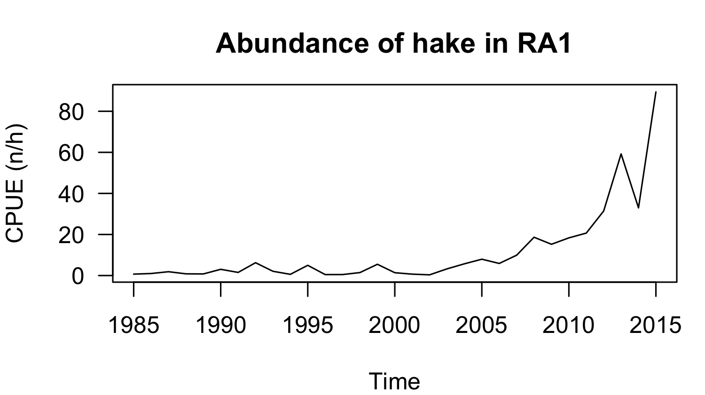<!-- -->

#### Solution

```r
#1
which(names_tensor[[1]]=="Merluccius merluccius")
#2
IBTS_tensor[33,4,1]
#3
IBTS_tensor[33,26:31,1]
#4
plot(names_tensor[[2]], IBTS_tensor[33,,1], type="l", 
     xlab="Time", ylab="CPUE (n/h)", main="Abundance of Hake in RA1")
```

***

##B. Two dimensions: Principal Component Analysis

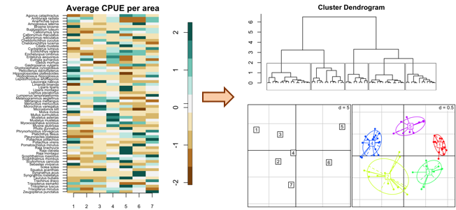

### Preparing the dataset

#### From 3D to 2D
The tensor is flattened into a 2D matrix. This section will study the spatial distribution of fishes in the North Sea. The abundance of fishes will be average over the period 1985-2015, losing the temporal information from the original dataset.

We create a new matrix `IBTS_space` which contain the average abundance for the 7 RA (in rows) and 65 species (in columns).

```r
IBTS_space <- apply(IBTS_tensor,c(3,1),mean)
dim(IBTS_space) #the new matrix has 7 rows (areas) and 65 columns (species)
[1]  7 65
```

#### Checking the distribution of the data
Principal Component Analysis, and other multivariate analysis in general, are sensible to outliers. So beforehand, one has to be check if the data is not too skewed. If it is the case, it is recommended to log (or square root) transform the data.


```r
#boxplot() is used to look at the distribution
boxplot(as.vector(IBTS_space), main="raw CPUE")
#The CPUE is very skewed, one can not see the difference between the 1st quarter, the median and the 3rd quarter
#So data should be log transformed
IBTS_logspace <- log(IBTS_space+1)
#The new distribution of the log transformed CPUE
boxplot(as.vector(IBTS_logspace), main="log CPUE")
```

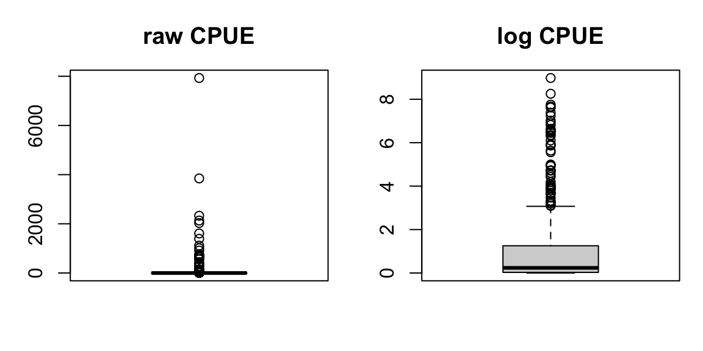<!-- -->

#### Scaling the data
The function used to run Principal Components Analysis normalized (i.e. center and scale) the variables by default. It is important to keep that step in mind. An illustration of the normalisation is given in the figures below. 
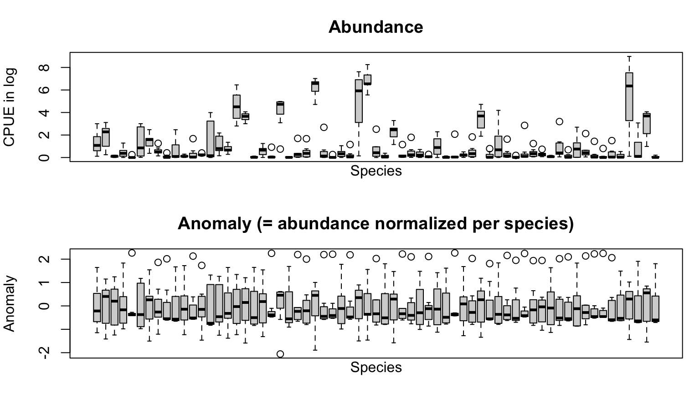<!-- -->

### Principal Component Analysis

#### Run a PCA and choose the correct number of PC.
The PCA is run with the function `dudi.pca`. The data is normalized with the options `scale` and `center` set to `TRUE`. The function is interactive, showing you a scree plot: the variance explained by the successive Principal Components (PC)

***

The PCA algorithm builds many Principal Component (PC), but not all of the PC perform well in simplifying the information. To choose the correct number of PC to be kept, there are many conflicting methods. The one I recommend is the scree test (Cattell, 1966): graphical detection of a bend in the distribution of the successive variance explained. As a comparison, a PCA run on random data will not find *strong* PC, i.e. PC can not reduce the dimensionality of the data. On the contrary, in real world data, usually we have a bend between successive variance explained by PC. Before the bend, the PCs reduce well the dimensionality of the data and should be kept (i.e. there is a significant pattern); after the bend, PC should be discarded (i.e. it is only noise). 


***


```r
pca_space=dudi.pca(IBTS_logspace, scale = TRUE, center = TRUE)
```

**Select the number of axes: **

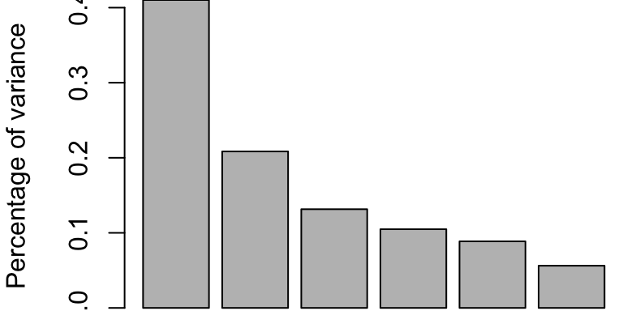<!-- -->

In our case, a bend can be seen on the scree plot after the second PC. So, **please type 2 and press Enter**.

The function `inertia.dudi` show how much variance is explained by the successive PC.

```r
#To see how much variance the axes explain:
inertia.dudi(pca_space)$TOT
```

```
    inertia      cum     ratio
1 26.662246 26.66225 0.4101884
2 13.552817 40.21506 0.6186933
3  8.547308 48.76237 0.7501903
4  6.815873 55.57824 0.8550499
5  5.766595 61.34484 0.9437667
6  3.655162 65.00000 1.0000000
```
In our case, the first PC explains 41% of the variance, the two first PC together explain 62% of the variance.

#### Interpretation of the PC.
The variable `pca_space`, result of the `dudi.pca`, contains two important matrices: `co`with the projetion of columns in the two PC; and `li` with the projection of the rows in the two PCs. **All PC kept in the analysis should be interpreted.**  
We can see the projection in a table directly by typing the name of these object, or by using graphical function `s.label()`.

```r
pca_space$li # or pca_space$co
```

```
       Axis1      Axis2
1 -7.3353689  3.8519039
2 -3.2640990 -2.0883788
3 -2.9030102  2.9885736
4 -0.4560783 -0.4644314
5  8.6404760  4.4337734
6  6.1761023 -2.2590725
7 -0.8580218 -6.4623682
```

```r
par(mfrow=c(1,2), mar=c(0,0,0,0))
#Show the weight of the variables:
s.label(pca_space$li, xax=1, yax=2)
s.label(pca_space$co, xax=1, yax=2, clabel = 0.4)
```

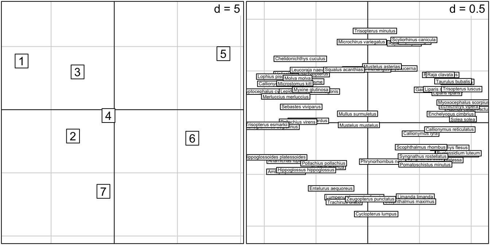<!-- -->

The first PC (x-axis) make the difference between the northern NS (RA 1, 2 and 3 have negative weights, projected on the left side) and the southern NS (RA 5 and 6 have positive weights, projected on the right side).  
The second PC (y-axis) make the difference between the South-Eastern NS (RA 7 have negative weight, projected on the lower side) and the rest of northern or western NS (RA 1 and 5 have positive weights, projected on the upper side).  
The species projection (right side) allow us to see differences between species, but the high number of species makes it difficult to characterize the species. One solution is to group these species, i.e. simplify the number of species into a smaller number of groups, and then characterize these new groups.

### Clustering the species
Clustering is a subject by itself, here we will only see quickly one of its most famous method: Hierarchical clustering. It works in 4 steps: 

1. Compute the distances between each objects. 
2. Build a tree according to a given joining criteria
3. Choose the number of cluster depending on the topology of the dendogram,
4. Create the clusters and interpret them


```r
#1. Compute the distance between species
dist_species=dist(pca_space$co, method = "euclidean")

#2. Build a tree with Ward method
den=hclust(dist_species,method = "ward.D2")

#3. Plot the dendogram
par(mar=c(2,3,3,1))
plot(den, hang=-1, ax = T, ann=T, xlab="", sub="", cex=0.6)

#Choosing the number of cluster
nclust<-5

#Visualize the cutting
rect.hclust(den, k=nclust, border="dimgrey")
```

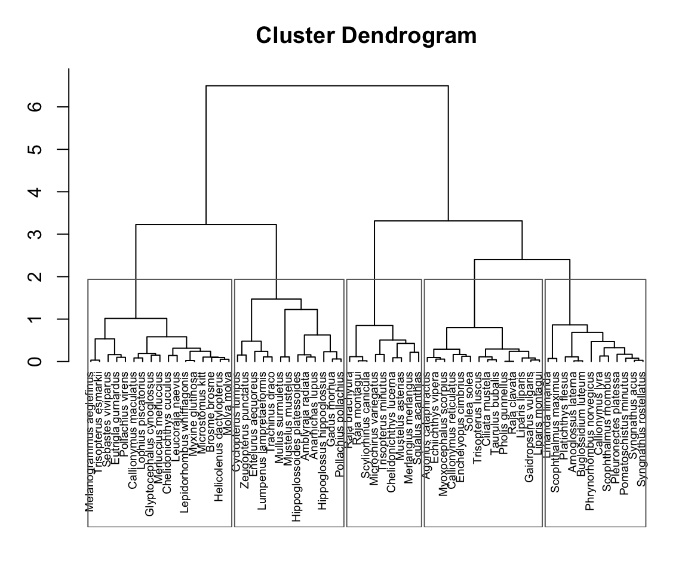<!-- -->

There are different linkage criteria (criterion used to group two objects). The most common ones are: *Single* (minimum distance between elements of each cluster), *Complete* (maximum distance between elements of each cluster), *Average* (mean distance between elements of each cluster, also called UPGMA) and *Ward* (decrease in variance for the cluster being merged). *Ward* linkage (Ward, 1963) is known to be more suitable for spherical data, and in most of the case, gives the best results. I invite you to try other linkage criteria by changing the parameter `method = ` in the function `hclust`. Do you find the same clusters?  

In the graph above, the question is where to put a horizontal line on the dendogram to create the clusters. The number of clusters should not be too sensitive of the height of the line. In our case, 5 clusters seem appropriate. We can now visualize how the hierarchical clustering grouped the species in 5 clusters on the two first PC.


```r
#4. Create the clusters
clust_space <- as.factor(cutree(den, k=nclust))

#Visualize the cluster in the PC axis
s.class(pca_space$co,fac=clust_space, col=rainbow(nclust),xax=1,yax=2)
```

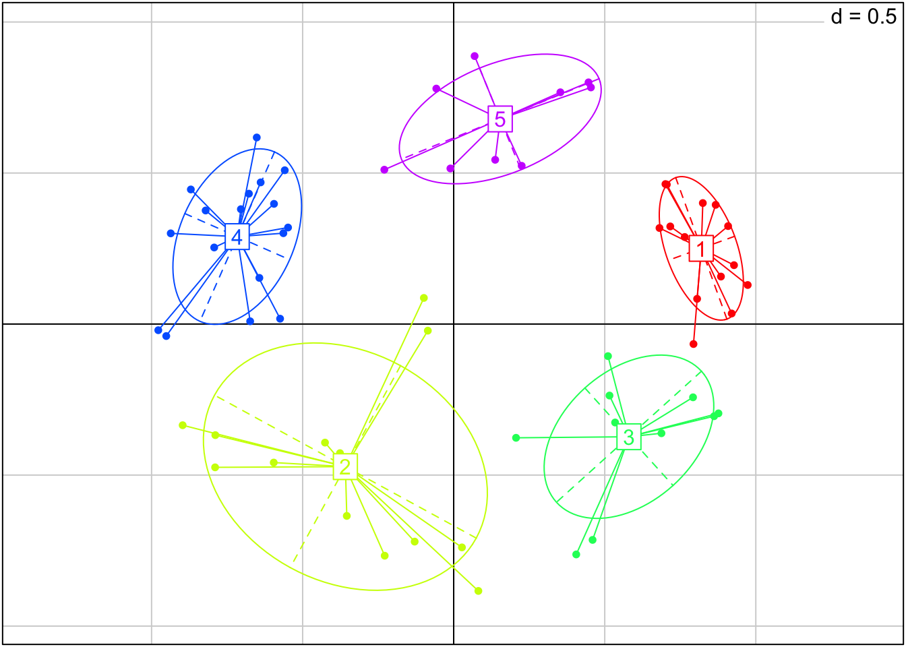<!-- -->

These clusters should be interpreted with the previous interpretation of the PC. For example, 

* Cluster 1 (in red) has high value in PC1, and above average value in PC2. So it groups species that lives in the southern North Sea (high PC1), with a preference in the south-western side (high PC2).  
* Cluster 2  (in yellow in the graph above) groups species mainly located in entrance to the Skagerrak, RA7 (low PC2) but that can spread in the north (low PC1). This cluster is heterogeneous, with the largest ellipse in the figure above.  
* Cluster 3 (in green) groups species mainly located in southern NS (high PC1), with a preference on its eastern side (low PC2).  

### Your turn: 
1. How would you interpret the clusters 4 and 5 ?
2. How many species are located mainly in the south-west of the North Sea (RA 5, i.e. grouped in cluster 1) ?
3. In which cluster is grouped Saithe (*Pollachius virens*)?
4. Depending on your time and your interest, you can either: 
    + change the initial matrix and run the same analysis, but categorizing species on their temporal variation over the North Sea (averaged over RA) with the matrix defined as: `IBTS_time <- apply(IBTS_tensor,c(2,1),mean)`
    + change the linkage method in the clustering algorithm and compare the clusters
    + or go directly to the next step: multivariate analysis in 3 dimension.

#### Solution
1. Cluster 4 (in blue) groups species spread exclusively in the northern NS (high PC1 and high PC2). Cluster 5 (in purple) groups species in majority either in the northern extremity (RA1) or the southwestern community (RA5) but not in RA 7 (high PC2)


```r
#2.
table(clust_space) #There are 14 species in cluster 1
```

```
clust_space
 1  2  3  4  5 
14 13 12 17  9 
```

```r
#3.
clust_space[names_tensor[[1]]=="Pollachius virens"] #Saithe is in cluster 4
```

```
Pollachius virens 
                4 
Levels: 1 2 3 4 5
```


***

## C. Three dimension: Tensor Decomposition

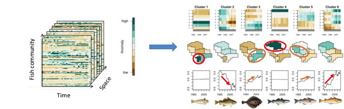  


### Preparing the dataset

#### Checking the distribution of the data
Like with PCA, we have to check the skewness of the data and log transform it if it is highly skewed.


```r
#boxplot() is used to look at the distribution
boxplot(IBTS_tensor, main="raw CPUE")
#Data should be log transformed
IBTS_logtensor <- log(IBTS_tensor+1)
#The new distribution of the log tranformed CPUE
boxplot(IBTS_logtensor, main="log CPUE")
```

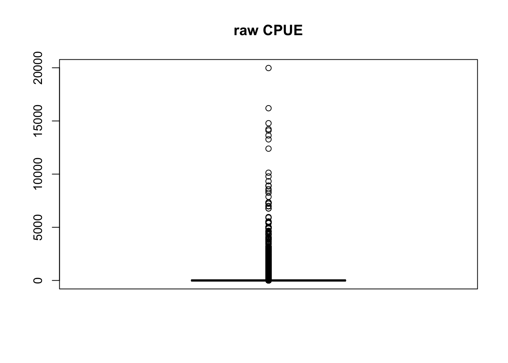<!-- -->

#### Scaling the data
Contrary to PCA, the normalization of a tensor is not straightforward, and have to be done manually before running a PTA. Here, we decided to normalize the values per species and saved them in a new tensor `IBTS_logscale`.


```r
#Scaling per species
#Create a new empty array
IBTS_logscale<-array(0,dim=dim(IBTS_tensor))
#Loop scanning each species
for (i in 1:dim(IBTS_tensor)[1]){
  #Calculating the mean and sd of the log CPUE for species i
  ma<-mean(IBTS_logtensor[i,,])
  sa<-sd(IBTS_logtensor[i,,])
  #Saving the anomaly in the array
  IBTS_logscale[i,,]<-(IBTS_logtensor[i,,]-ma)/sa
}
#Copy the labels to the new array
dimnames(IBTS_logscale)<-dimnames(IBTS_tensor)
```

### Run a PTA
#### Run the PTA and choosing the number of PT.
The PTA is run with the function `PTA3`. The number of principal tensor is indicated by `nbPT` and `nbPT2`. One chooses the number of principal tensors at each *level* of analysis by `nbPT`, the last level (2-modes analysis) is fixed by `nbPT2`.  
The Principal Tensor Analysis computed three main principal tensor and their two mode associated principal tensors.

```r
pta<-PTA3(IBTS_logscale, nbPT = 3, nbPT2 = 3, minpct = 0.1)
```

```
 ---Final iteration---  28 
 --Singular Value--  57.63059  -- Local Percent --  23.65587 % 
 ---Final iteration---  30 
 --Singular Value--  27.13744  -- Local Percent --  12.05884 % 
 ---Final iteration---  92 
 --Singular Value--  13.52781  -- Local Percent --  5.369746 % 

 -----Execution Time----- 0.465 
```

```r
summary.PTAk(pta,testvar = 0)
```

```

 ++++ PTA-  3 modes ++++  
               data=  IBTS_logscale   65 31 7 
                ------Percent Rebuilt---- 56.37922 % 
                ------Percent Rebuilt from Selected ---- 56.37922 % 
              -no- --Sing Val--  --ssX-- --local Pct-- --Global Pct--
vs111            1      57.6306 14040.00       23.6559      23.655875
65 vs111 31 7    3       9.0978  3464.06        2.3894       0.589533
65 vs111 31 7    4       5.2054  3464.06        0.7822       0.192991
31 vs111 65 7    6      35.0333  6511.03       18.8500       8.741668
31 vs111 65 7    7      28.0998  6511.03       12.1271       5.623930
7 vs111 65 31    9      17.6930  4600.42        6.8047       2.229654
7 vs111 65 31   10      11.4570  4600.42        2.8533       0.934920
vs222           11      27.1374  6107.06       12.0588       5.245304
65 vs222 31 7   13       4.1761   789.39        2.2093       0.124215
65 vs222 31 7   14       3.5684   789.39        1.6131       0.090693
31 vs222 65 7   16      13.7724  1313.69       14.4387       1.350994
31 vs222 65 7   17      12.4827  1313.69       11.8612       1.109821
7 vs222 65 31   19      14.0761  2068.85        9.5771       1.411229
7 vs222 65 31   20      13.0077  2068.85        8.1785       1.205129
vs333           21      13.5278  3408.02        5.3697       1.303431
65 vs333 31 7   23       4.3630   220.69        8.6256       0.135581
65 vs333 31 7   24       3.0676   220.69        4.2639       0.067022
31 vs333 65 7   26       7.9591   336.79       18.8094       0.451196
31 vs333 65 7   27       6.3762   336.79       12.0715       0.289568
7 vs333 65 31   29      11.6585   996.61       13.6383       0.968089
7 vs333 65 31   30       9.6144   996.61        9.2751       0.658381

 ++++               ++++ 
 over  21  PT  
```

#### Choosing the number of PT.

To select the significant PT, we build the scree plot from the global variance explained.

```r
#Create the scree plot
out <- !substr(pta[[3]]$vsnam, 1, 1) == "*"
gct<-(pta[[3]]$pct*pta[[3]]$ssX/pta[[3]]$ssX[1])[out]
barplot(sort(gct, decreasing = TRUE), xlab="PT",
        ylab="Percentage of variance")
```

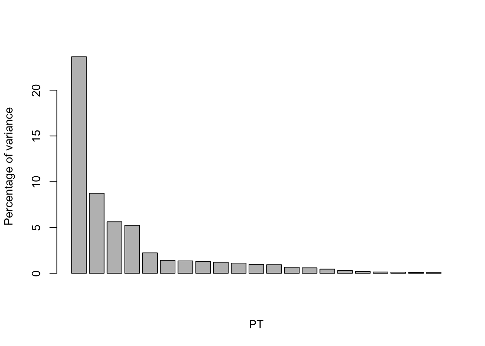<!-- -->

A bend can be seen after 4 PT, so we will select the 4 PT with the best explaining power. Numerically, it corresponds to the PT 1, 6, 7 and 11 of our object `pta`

####Interpretation of PT.
The plotting function per default allow to use the argument `mod` to select which dimension to plot, `nb1` and `nb2` to select which PT will be shown on x-axis and y-axis.
For example, we plot the time and space components (the second and third dimension of the array, so `mod=c(2,3)`) projected on vs111 and vs222 (respectively the elements 1 and 11 of `pta`, so `nb1 = 1, nb2 = 11`):

```r
par(mfrow=c(1,2))
plot(pta, mod=c(2,3), nb1 = 1, nb2 = 11, xpd=NA, lengthlabels = 4)
plot(pta, mod=1, nb1 = 1, nb2 = 11, lengthlabels = 3)
```

<!-- -->

We can see from the plot above that vs111 characterize the space (green crosses representing RA are spread over vs111) and vs222 characterize the time (red triangles representing years are spread over vs222).  
vs111 makes the difference between the northern NS (RA 1, 2 and 3 have negative weights, projected on the left side) and the southern NS (RA 5 and 6 have positive weights, projected on the right side).  
vs222 shows a temporal trend and makes the difference between the period 1985-1998 (years before 1998 have negative weights, projected on the lower side) and the recent period 2003-2015 (years after 2003 have positive weights, projected on the upper side).  
The species projection (right side, created with `mod=1`) allow us to see the species plotted on these two PT. For example, we can see Cod (abbreviated *Gad*) in the upper part: it is the species with the strongest decrease in abundance (the highest point in vs222), and doesn't have clear spatial north-south pattern. However, the high number of species makes it difficult to characterize each species (suggesting the need for clustering).

Similar plot can be done for the two other significant PT


```r
par(mfrow=c(2,2))
plot(pta, mod=c(2,3), nb1 = 1, nb2 = 6, xpd=NA, lengthlabels = 4)
plot(pta, mod=1, nb1 = 1, nb2 = 6, xpd=NA, lengthlabels = 4)
plot(pta, mod=c(2,3), nb1 = 1, nb2 = 7, xpd=NA, lengthlabels = 4)
plot(pta, mod=1, nb1 = 1, nb2 = 7, xpd=NA, lengthlabels = 4)
```

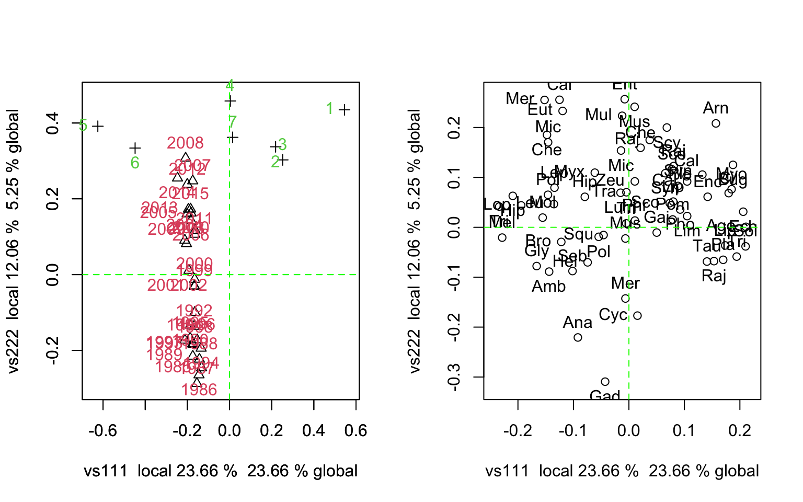<!-- -->

31vs111 are temporal mode PT associated with vs111, meaning that vs111 and 31vs111 share the same temporal component. This feature can be seen with the straight line representing the projection of the years on these PT. 

Another way to represent the spatiotemporal variations of the PT is to use a 2D representation, with x-axis being the time and y-axis being the space. The graphical functions are out of scope of this tutorial but presented here to help the interpretation.

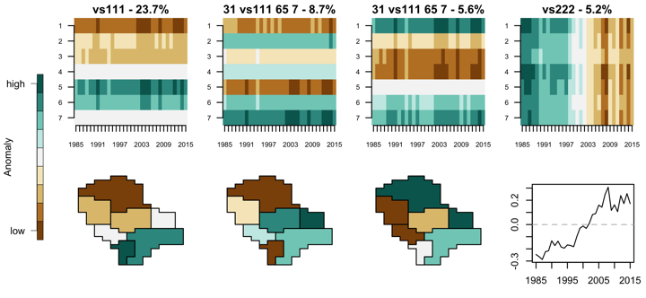  


###Clustering
We use the same approach as before, but with the species projected on the 4 PT.

```r
#Create the matrix with the projection of species on the 4 PT
keep <- c(1, 6, 7, 11) # PT that are kept in the analysis
coo<-t(pta[[1]]$v[c(keep),])
labkeep <- paste0(pta[[3]]$vsnam[keep], " - ", round((100 * (pta[[3]]$d[keep])^2)/pta[[3]]$ssX[1],1), "%")

#1. Compute the distance between species
dist1=dist(coo, method = "euclidean")

#2. Build a tree with Ward linkage
den=hclust(dist1,method = "ward.D2")

#3. Plot the dendogram
par(mar=c(1,3,1,1))
plot(den, hang=-1, ax = T, ann=F, xlab="", sub="",labels = FALSE)

#Choose the number of clusters
nclust<-6

#Visualize the cutting
rect.hclust(den, k=nclust, border=rainbow(nclust)[c(6,5,2,4,3,1)])
```

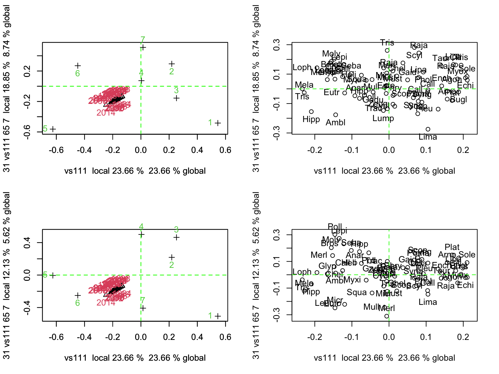<!-- -->

The dendogram suggest to create 6 clusters. It is now important to interpret the clusters by projecting them on the PT.


```r
#4. Create the clusters
clust_3D <- as.factor(cutree(den, k=nclust))

#Visualize them 
par(mfrow=c(1,3))
s.class(coo, fac = clust_3D, xax=1, yax=2, col=rainbow(nclust), clabel = 2)
text(min(coo[,1])-0.03,0, labkeep[2], srt=90, xpd=NA, cex=1.5)
text(0,max(coo[,2])+0.02, labkeep[1], xpd=NA, cex=1.5)
s.class(coo, fac = clust_3D, xax=1, yax=3, col=rainbow(nclust), clabel = 2)
text(min(coo[,1])-0.03,0, labkeep[3], srt=90, xpd=NA, cex=1.5)
text(0,max(coo[,3])+0.02, labkeep[1], xpd=NA, cex=1.5)
s.class(coo, fac = clust_3D, xax=1, yax=4, col=rainbow(nclust), clabel = 2)
text(min(coo[,1])-0.03,0, labkeep[4], srt=90, xpd=NA, cex=1.5)
text(0,max(coo[,4])+0.02, labkeep[1], xpd=NA, cex=1.5)
```

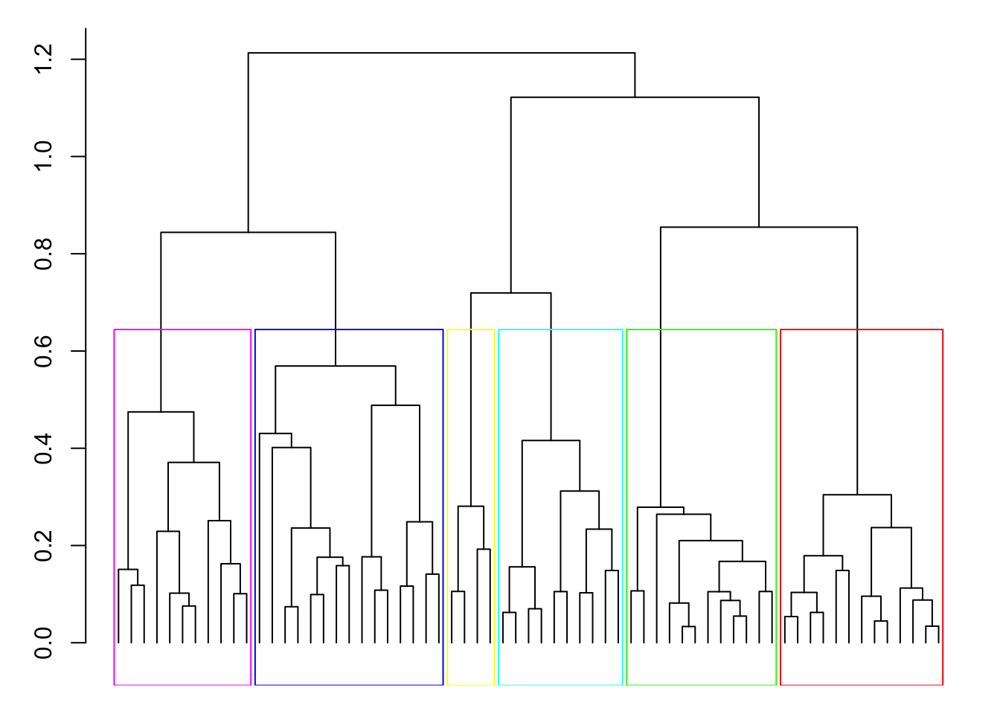<!-- -->

* Cluster 1 is the southern community with high abundance in RA5 and no temporal pattern.
* Cluster 2 is the community with decreasing abundance and no clear spatial pattern.
* Cluster 3 is the South-East community with small increase in abondance
* Cluster 4 is the northern community with high abundance in RA1 and no temporal trend.
* Cluster 5 is the North-West community with a small increase in abondance
* Cluster 6 is the increasing community, mainly pronounced in RA 1, 3 and 5

  

##Summary

Multivariate analysis are methods to simplify complex and multidimensional dataset. The dimensions are simplified with the objective of keeping most of the variance. In this process, the information and the noise are separated; the main patterns being revealed by the principal components. Multivariate analysis are data-mining tools, in other words they are not predictive or mechanistic tools but data-driven. They can help to visualize and characterize what information is hidden in large dataset.

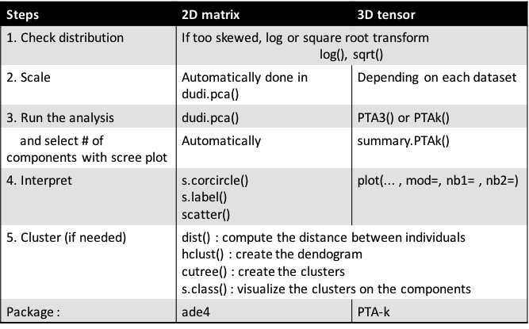


##References

Cattell, R. B. (1966). *The scree test for the number of factors.* Multivariate behavioral research,1(2), 245-276.

Cichocki, A., Mandic, D., De Lathauwer, L., Zhou, G., Zhao, Q., Caiafa, C., & Phan, H. A. (2015). *Tensor decompositions for signal processing applications: From two-way to multiway component analysis.* IEEE Signal Processing Magazine, 32(2), 145-163.

Leibovici, D. G. (2010). *Spatio-temporal multiway decompositions using principal tensor analysis on k-modes: The R package PTAk*. Journal of Statistical Software, 34(10), 1-34.

Ward Jr, J. H. (1963). *Hierarchical grouping to optimize an objective function*. Journal of the American statistical association, 58(301): 236-244.


